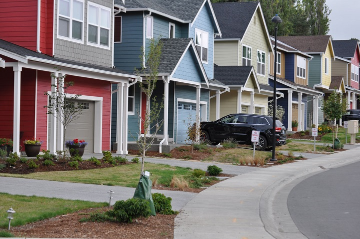

# House-Price-Regression
Predição de preços de casas em King Conty utilizando vários modelos de regressão.

Trabalho realizado para a matéria de Mineração de Dados da UFSCar.

### Dataset utilizado: [House Sales in King County, USA](https://www.kaggle.com/harlfoxem/housesalesprediction) 

`id` - Identificador único para cada casa  
`date` - Data em que a casa foi vendida  
`price` - **Alvo da previsão**   
`bedrooms` - Número de quartos na casa  
`bathrooms` - Número de banheiros/quartos    
`sqft_living` - Metragem quadrada da casa  
`sqft_lot` - Metragem quadrada do lote  
`floors` - Total de pisos (andares) da casa    
`waterfront` - Casa que tem vista para o mar   
`view` - Foi vista  
`condition` - Quão boa é a condição da casa (geral)    
`grade` - Nota geral dada à unidade habitacional, com base no sistema de classificação de King Contry    
`sqft_above` - Metragem quadrada da casa além do porão/fundação  
`sqft_basement` - Metragem quadrada do porão/fundação  
`yr_built` - ano de construção  
`yr_renovated` - Ano em que a casa foi reformada  
`zipcode` - Código postal  
`lat` - Coordenada de Latitude  
`long`- Coordenada de Longitude    
`sqft_living15` - Área da sala de estar em 2015 (implica algumas reformas) isso pode ou não ter afetado a metragem quadrada do lote  
`sqft_lot15` - Tamanho do lote em 2015 (implica algumas reformas)  
